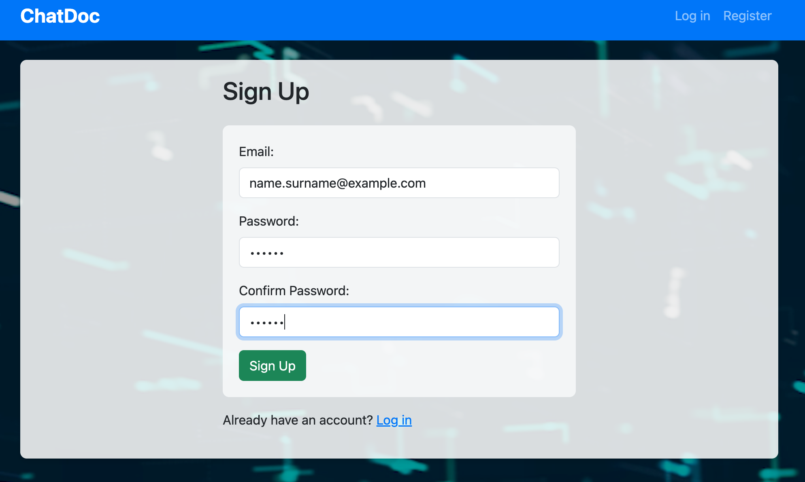
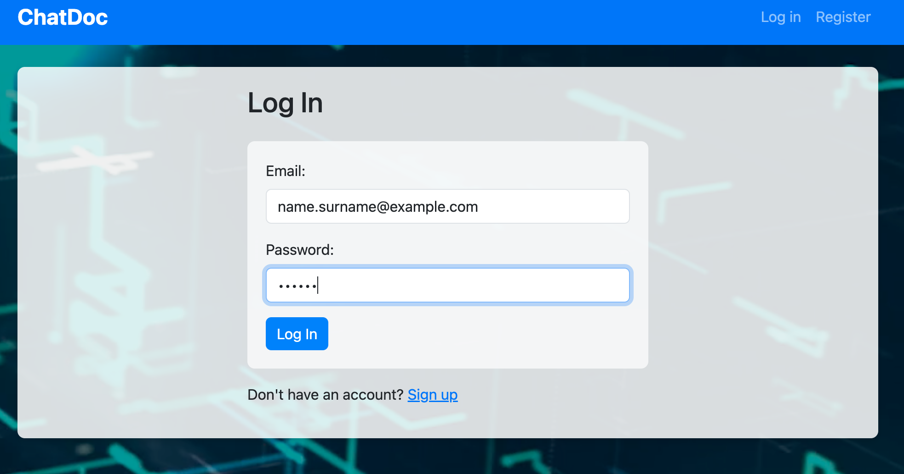
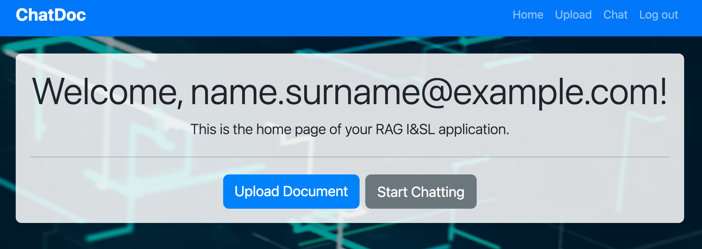
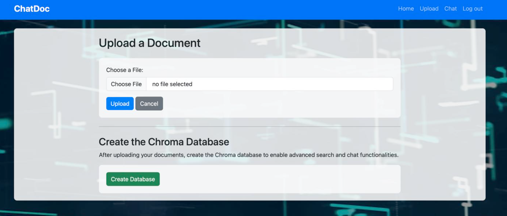
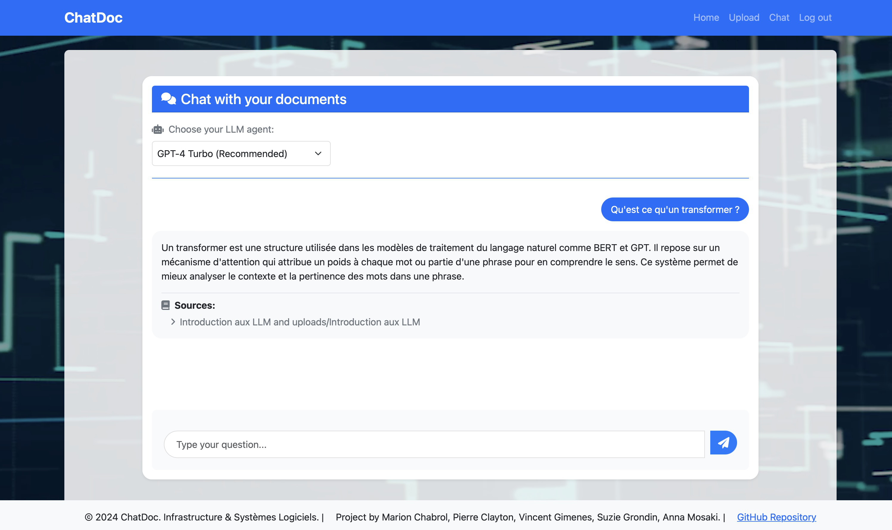

# ChatDoc - Document Chat Application

An intelligent web application that enables users to upload documents and engage in conversations about their content using advanced Large Language Model technology. Built with FastAPI, Firebase authentication, and OpenAI's GPT models.

## 🌟 Features

- **Secure Authentication**: User management through Firebase authentication
- **Document Processing**: 
  - Support for multiple file formats (PDF, DOCX, TXT, MD)
  - Automatic conversion to markdown format
  - Smart chunking for optimal processing
- **Intelligent Chat Interface**:
  - Context-aware conversations about uploaded documents
  - Source attribution for answers
  - Persistent chat history
- **Vector Database**: Efficient document storage and retrieval using Chroma
- **Modern UI**: Responsive design with Bootstrap 5
- **Background Processing**: Asynchronous document processing and database generation

## 🛠️ Prerequisites

- Python 3.10 or 3.11
- OpenAI API key
- Firebase project credentials
- Docker (optional, for containerized deployment)

## 📦 Installation

### Option 1: Local Development

1. **Clone the Repository**
```bash
git clone https://github.com/Pierre-Clayton/Project-I-SL.git
cd Project-I-SL
```

2. **Set Up Virtual Environment**

Linux/MacOS:
```bash
python3 -m venv venv
source venv/bin/activate
```

Windows:
```bash
python -m venv .venv
.venv\Scripts\activate
```

3. **Install Dependencies**
```bash
pip install -r requirements.txt
pip install "unstructured[md]"
```

### Option 2: Docker Deployment (make sure to start your Docker app before)

1. **Build the Docker Image**
```bash
docker build -t chatdoc .
```

2. **Run the Container**
```bash
docker run -p 8000:8000 chatdoc
```

## ⚙️ Configuration

(if you do not use docker)
Install Ollama on your computer
Then execute on a terminal:

```shell
ollama pull tinyllama
ollama serve
```

## 🚀 Running the Application

### Local Development
```bash
cd app
python -m uvicorn main:app --reload
```

### Docker Container
The application will automatically start when running the container. To acces to the app, make sure to click on the following links and **not the ones in your terminal**. 

Access the application:
- Web Interface: `http://127.0.0.1:8000`
- API Documentation: `http://127.0.0.1:8000/docs`

# 💡 ChatDoc Usage Guide

## 1. Authentication

### **Sign Up**
- Navigate to `/register`.
- Enter your email and password, then confirm your password.
- Click **"Sign Up"** to create your account.

### **Log In**
- Navigate to `/login`.
- Enter your credentials and click **"Log In"** to access your account.

<div style="display: flex; flex-wrap: nowrap; justify-content: space-between; align-items: center;">
  
  
</div>

---

## 2. Home Page

After logging in, you'll land on the home page, where you can start chatting with your documents or upload more files.



---

## 3. Document Management

### **Upload Documents**
- Click **"Upload Document"** on the home page.
- Select your file (PDF, DOCX, TXT, or MD).
- Click **"Upload"** and wait for the confirmation message.



### **Generate Database**
- After uploading documents, click **"Create Database"**.
- Wait for the confirmation message.
- Your documents are now ready for advanced search and chat functionalities.

---

## 4. Chat Interface

### **Start a Chat**
- Click **"Start Chatting"** on the home page.
- Type your question in the input field and press **Enter** or click the send button.
- View the AI's response, which includes source attribution.


## 🔧 Project Structure

```
Project-I-SL/
├── .venv/              # Python virtual environment
├── app/
│   ├── config/
│   │   └── firebase_config.json
│   ├── static/
│   │   ├── css/
│   │   │   └── styles.css
│   │   └── videos/
│   │       └── background.mp4
│   ├── templates/
│   │   ├── base.html
│   │   ├── chat.html
│   │   ├── home.html
│   │   ├── login.html
│   │   ├── register.html
│   │   └── upload.html
│   ├── create_database.py
│   ├── file_upload.py
│   ├── main.py
│   ├── query_data.py
|   ├── test_main.py
|   ├── test_query_data.py
│   └── user_auth.py
├── example_images/
│   ├── firstscreen_example.png
│   ├── login_example.png
│   ├── signup_example.png
│   ├── upload_example.png
│   └── chat_example.png
├── .env
├── .gitignore
├── API Keys.txt
├── Dockerfile
├── README.md
└── requirements.txt
```

## 📝 License

This project is part of the Infrastructure & Systèmes Logiciels course. Created by:
- Marion Chabrol
- Pierre Clayton
- Vincent Gimenes
- Suzie Grondin
- Anna Mosaki

## 🔗 Links

- GitHub Repository: [https://github.com/Pierre-Clayton/Project-I-SL](https://github.com/Pierre-Clayton/Project-I-SL)

